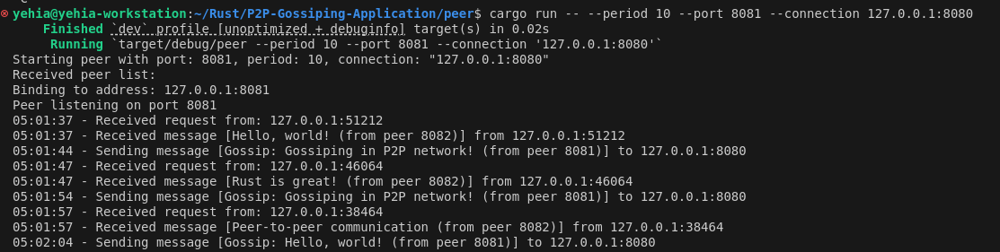

# P2P-Gossiping-Application

## Overview

This project implements a simple peer-to-peer (P2P) gossiping application in Rust. Each peer can connect to other peers, send random gossip messages periodically, and print received messages to the console.

## Features

- Simple CLI interface for starting and connecting peers.
- Periodic gossip messages sent to connected peers.
- Console output for received messages.
- Modularized code for better readability and maintainability.

## Prerequisites

- Rust (install from [rustup.rs](https://rustup.rs/))

## Installation

Clone the repository:

```

git clone https://github.com/YehiaSobeh/P2P-Gossiping-Application.git

```

```
cd P2P-Gossiping-Application/peer

```

Build the project:


cargo build
Usage
You can start peers with different configurations using the CLI. Below are some examples:

Starting the First Peer
Start the first peer with a messaging period of 5 seconds on port 8080:


```
cargo run -- --period 5 --port 8080
```

Starting a Second Peer

Start the second peer with a messaging period of 10 seconds, connecting to the first peer on port 8081:


```
cargo run -- --period 10 --port 8081 --connection 127.0.0.1:8080
```

Starting Additional Peers
You can add more peers similarly. For example, start a third peer with a messaging period of 7 seconds, connecting to the first peer on port 8082:


```
cargo run -- --period 7 --port 8082 --connection 127.0.0.1:8080
```

Example Output
Here is an example output for a peer:
```
Starting peer with port: 8081, period: 10, connection: "127.0.0.1:8080"
Received peer list: 
Binding to address: 127.0.0.1:8081
Peer listening on port 8081
05:01:37 - Received message [Hello, world! (from peer 8082)] from 127.0.0.1:51212
05:01:44 - Sending message [Gossip: Gossiping in P2P network! (from peer 8081)] to 127.0.0.1:8080
```




Project Structure
```
P2P-Gossiping-Application
│  peer
│  ├── src
│  │   ├── cli.rs          # Handles CLI argument parsing
│  │   ├── connection.rs   # Manages connections and peer list requests
│  │   ├── message.rs      # Generates random gossip messages
│  │   ├── peer.rs         # Core peer functionalities
│  │   └── main.rs         # Entry point of the application
│  └── Cargo.toml          # Cargo configuration file
└── README.md           # This file
```
